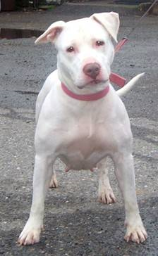

#机器学习纳米学位：猫狗大战

 

###I. 问题的定义

**项目概述**

在这个项目中，我们要做的是对猫狗图像进行分类，使得机器能够很好地识别出一张图像是猫或者狗，问题涉及到机器学习中的cv方向，对此我决定从深度学习的角度出发，通过迁移学习来解决这个问题，在这个项目中，所用的数据集是kaggle提供的猫狗图像，其中，用于训练模型的有25000张已经分类好的猫狗图像，以及12500张用于测试模型结果的未分类图像，问题属于有监督图像二分类问题

 

**问题陈述**

对于这个项目，我们面临的主要问题是如何构建并训练一个较好的深度学习模型来对我们当前的图片进行分类，并获得一个较好的效果，为此我们将问题的解决分为以下几个步骤：

1. 对所给训练集的清洗：在项目所给的训练集中拥有一些与我们所需求的猫狗图片无关的样本，这样的样本会对我们模型最后的分类结果造成一定的影响，所以我们要识别并删除掉这些错误的样本

2. 对现有模型去除顶部后导出特征向量：由于当前我们所面临的问题，目前拥有一些已经有的模型来解决于此相似的问题，在考虑各项成本及效果的情况下，对已经有的模型进行迁移是一个较好的想法，但现有模型并不能完全达到我们要求的效果，所以我们要去除现有模型用于最后分类的顶部全连接层，而使用自己重写的全连接层，但在此之前我们要解决的问题为将除全连接层外的特征导出

3. 利用已经导出的特征来训练自己的全连接层：在我们将图片经过我们所要迁移的模型的除全连接层外的所有层的特征导出后，我们将利用这些特征来对我们自己的全连接层进行训练，得到一个最终的模型

4. 利用模型去预测训练集：在我们已经构建好模型后，我们要利用我们最后的模型去对kaggle的最终测试集进行预测生成CSV文件后提交

 

**评价指标**

在这个项目中根据kaggle的要求，使用logloss作为模型的评估标准logloss的评估公式为

​                                                  
$$
LogLoss=-\frac{1}{n}\sum_{i=1}^{n}\left[y_i\log{\left({\hat{y}}_i\right)}+\left(1-y_i\right)\log{\left(1-{\hat{y}}_i\right)}\right]
$$
在logloss中

n是测试集中的图像总数

$$y ̂_i是图像为狗的概率$$

$$y_i$$如果为1则图片为狗，如果为0则图片为猫

Log（）是基数为e的对数

LogLoss 的取值范围0-1之间，其中数值越趋于0说明模型效果越好，在该项目中，要求LogLoss的值小于0.06127

 

 

###II. 分析

**数据的探索**

在该项目中,数据集来自kaggle的[Dogs vs. Cats Redux: Kernels Edition](https://www.kaggle.com/c/dogs-vs-cats-redux-kernels-edition/data),该数据集为彩色的猫狗图片，其中猫狗各12500张图片，图片格式为JPG，猫狗图片比例为1:1在数据集中绝大多数的图片清晰，光线充足，多数为日常拍摄，有少量的特写，其中的图片尺寸大小不一，但图片中猫狗图像居中，需要后期对图片进行归一化处理，数据集中存在少量异常数据（图片中没有猫狗或图片较为混乱无法辨识），在训练前需要对数据集进行清洗[1]

数据集中的图片样例：

   




图像的大小分布：

   


猫狗图片数量的对比：

 

   

可以看出猫狗图片数量基本持平

 

**探索性可视化**

 

对图像中的猫狗图片分别进行可视化


​			   


从数据的样例中我们可以看出，大多数的图片是清晰准确的，图像中猫狗的位置清晰，光线充足，辨识度较高。

 

**算法和技术**

```
在这个项目中我们主题思想采用的是模型融合，我们选用ImageNet上在分类效果较好的三个模型，Xception， InceptionV2, Resnet50,三个模型，将三个不同的网络输出的特征向量通过我们自己的全连结层，使得适用于我们的当前所需要解决的问题[2]
 
```

三个模型在ImageNet上的表现：


   

​	可以看到，三个模型在ImageNet上的表现都较为出色，所以我们预计将其迁移到我们当前面临的问题时会拥有较好的效果

​	在开始之前首先使用Resnet50，Xceptioo, InceptionV2对所有的图片进行识别，剔除每个模型对图片识别中前50个可能不是猫狗的图片

​	然后使用image.ImageDataGenerator对图片预处理，将不同种类的图片分在不同的文件夹中，采用的思路是创建符号链接（smbol link）

​	我们通过keras.applications将三个模型引入，并引入三个模型的预处理函数，及图片大小，因为需要将数据限定于（-1,1）的范围内，然后我们为了防止文件过大及过拟合，我们使用keras.layers中的 GlobalAveragePooling2D将卷积层输出求均值

​	然后我们利用model.predict_generator 函数来导出特征向量，利用h5py导出为.h5文件，其中每个文件中拥有三个numpy数组

​	然后我们将导出的模型通过我们自己建立的全连接层，在全连接层部分比较简单，仅仅一个Dropout以及一个Dense层，由于我们这个分类是二分类问题，故将Dense的输出空间维度设为1，采用sigmoid作为激活函数[3]模型编译时采用adadelate作优化，binary_crossentropy作为损失函数[3]

​	在最后，进行训练，这里我们用数据集的0.8进行训练0.2进行验证，在训练过程中，我们采用keras.callcacks.ModelCheckpoint作为回调函数，记录并使用训练中的最优模型

​	在模型方面，Resnet50，Xceptioo, InceptionV2三个模型各有优点，在Resnet中实际了一种残差网络，这可以让我们训练更深的网络，残差网络在输入和输出之间建立直连接，新增层仅仅需要在原来的输入层基础上学习新的特征[4] 

​						 		

​	在inceptionV3中，使用了inception模块，目的是充当“多级特征提取器”，使用使用1×1、3×3和5×5的卷积核，最后把这些卷积输出连接起来，当做下一层的输入

 

​		   

 

​	在Xption是Inception架构的扩展，它使用深度可分离的卷积代替了了Inception模块[6]

​		 

​	同时，在Xcepotion上采用了图像区域和通道分开考虑的思想，Xception对每一个通道进行各自的卷积操作，有多少个通道就有多少个过滤器。得到新的通道feature maps之后，这时再对这批新的通道feature maps进行标准的1×1跨通道卷积操作。这种操作被称为 “DepthWise convolution” ，缩写“DW”。 一个depthwise操作比标准的卷积操作降低不少的参数量,也使得模型得到了更好的分类效果[7]


​	在项目中的卷积网络中，关键部件主要包含，卷积层，池化层，激活函数，以及全连结层几类，卷积层通过一定大小的额卷积核用于局部图像区域按照设定的步长移动卷积核，获取图像的局部信息，用于检测颜色，形状，问题等众多基本模式的滤波器都可以包含在一个足够复杂的深度卷积神经网络中，通过组合这些滤波器（卷积核）以及随着网络后续操作的进行，基本而一般的模式会主键被抽象为有高层次语义的概念

​	激活函数又称非线性映射层，激活函数的作用是为了正价整个网络的表达能力，否则若干线性的堆叠仍然只能起到线性映射的作用，无法形成复杂的函数

​	池化层的作用是在保证特征不变性的情况下实现特征降维，并且能在一定程度上防止过拟合，更方便优化

​	全连结成在整个卷积神经网络中起到‘分类器’的作用，是将所学到的特征表示映射到样本的标记空间作用[8]

 

**模型基准**

​	在这个项目中，效果要求达到kaggle Public Leaderboard 前 10%，所以在将本次基准定位为logloss要低于0.06127


###III. 方法

**数据预处理**

​	在数据预处理阶段我们采用主体思想是是使图片经过Resnet50，Xceptioo, IncepitionV3三个模型的ImageNet预训练网络识别出非猫狗图片进行删除，具体实现方法为通过keras的application层引入模型，通过model.decode_predictions对图片进行预测，其中我将其中的top参数设置为50，这样会返回这几个模型对于图片预测的前50个可能，这样做能够有效考虑到几个模型可能会预测不准的情况

​	在几个模型对所有训练集的图片进行预测后，由于最后错误图片并是过多，所以我们对各个模型预测不是猫狗图片的取并集（提高训练数据集的清洗效果），然后对所有判别为非猫狗图片的进行删除

​	然后通过image.ImageDataGenerator对图片预处理，将不同种类的图片分在不同的文件夹中，采用的思路是创建模号链接（smbol link）

 

**执行过程**

 

主体结构


​	我建立模型的主体结构如上图，在执行过程阶段首先保存图片通过InceptionV3，Xception，Resnet50三个模型之后的特征，在保存特征阶段具体步骤如下：
1．通过layers.input()重新定义输入层，并且三个模型需要通过各自模型的预处理函数将数据限定在（-1,1）的范围内
2．实现各个模型的初始化定义，将上面的预处理结果输入，调参时选择使用ImageNet的训练参数，去除顶部全连接层
3．通过Model函数使用GlobalAveragePooling2D 将卷积层输出的每个激活图直接求平均值，防止文件过大及过拟合现象
4．通过gen.flow_from_directory导出训练集和测试集的特征向量，设置一个批次为16，且训练集返回标签
5．通过model.predict_generator 发生器将导出全部图片的特征向量
6．通过h5py将各个图片的特征向量导出为文件，每个文件有三个numpy数组分别是train，test的特征向量，以及标签

​	导出为文件后，遍历三个文件通过np.concatenate将三个文件中的各个numpy数组拼接，通过sklearn.utils.shuffle打乱训练样本，防止后面keras从训练集中分离验证集时出错
​	在数据拼接之后我们在后面架构一个简单的全连结层，在我们自己架构的结构中有两层结构，一个Droput层，其中参数设置为0.5，这能有效防止过拟合，在后面连接一个Dense层，由于我们这个为二分类问题，我们将输出空间维度设置为1，激活函数设置为sigmoid,并且在编译阶段我们使用optimizer='adadelta',loss='binary_crossentropy',metrics=['accuracy'] [3]
Model.summary():

   

 		

至此模型架构完成

​	在程序的书写过程中，gen.flow_from_directory函数参阅的文档曾经是keras1的文档，单使用的是keras2以后的框架，导致参数不对，中间耽误了很长时间


**完善**

​	在模型的建立阶段，我曾在Resnet50 与 InceptionResNetV2之间进行了取舍，分别我对比了使用两个函数与其他模型融合后的结果，如图：


​						使用Resnet50, InceptionV3，Xception的模型效果 


​			   

​					使用InceptionResNetV2，InceptionV3，Xception的模型效果

​	在不改变学习率的情况下两者几乎看不出什么差别，两个模型的最小valloss分别是0.0079和0.0087，使用ResNet50的效果表现相对更加出色一点点，当前参数下模型差异不大，两个模型都很优秀，因为使用ResNet50，InceptionV3，Xception三个模型迁移的结果相对更好一些，所以我使用ResNet50代替了IncetionResNetV2
​    	之后在优化函数的阶段我使得optimizer='adadelta', loss='binary_crossentropy，metrics=['accuracy'][3]，并使用keras.callbacks.ModelCheckpoint作为回调函数，去记录并使用训练中的最优的模型 

###IV. 结果

 

**模型的评价与验证**

​	最终结果结果合理，与期待结果相符，过程中的各类参数合理，模型结果在kaggle上的评分为0.03876达到最初定下的基准

​	这个模型鲁棒性较佳，数据集等做一些微小改变不会对模型本身造成太大的影响，模型稳健可靠，单深度学习本身存在一定的随机性，模型效果会有极小幅度的波动，范围在可接受范围内，最终由12500张图片对模型进行最终测试，可以看出，结果可信

**合理性分析**


​	最终结果结果合理，与期待结果相符，过程中的各类参数合理，模型结果在kaggle上的评分为0.03876，比项目开始阶段的基准优秀许多

 

​	由此可见，模型切实的解决了我们的问题，它能够良好的辨别猫狗图片，识别结果较为优秀
验证结果： 


###V. 项目结论

**结果可视化**

   	在这个项目中我对输入数据，相关结果，以及训练过程中的acc，less的变化均做了可视化，并且在上面的过程中已经对可视化结果进行了详细讨论，且绘图的坐标轴，标题，基准面清晰明确

 

数据集可视化：

​			   


训练过程可视化


结果可视化


**对项目的思考**

​	项目的整个流程分为：数据处理=>特征导出=>自定义全连接层=>模型训练=>测试结果几个部分，在训练结束后对模型的测试阶段较为有趣，可以对自己拍摄的照片进行分析，在特征向量的导出部分是项目整体的难点，多次查询文档并进行更改后才得出最终结果
	这个模型符合对这个问题的期望，在绝大多数场景中能够有效的分析出图片中是猫或是狗，且分析结果较为优秀


**需要作出的改进**

​	在模型的整体架构方面，对现有模型进行迁移的部分做的较好，时间关系，本次项目中没有对数据集图片进行增强，对数据集进行数据增强会一定程度上使得模型的结果会更加优秀，如果以当前模型作为基准，想要继续从迁移学习的角度进行进一步的加强可能有些难度，但是可以考虑补充基础知识，针对这样的项目从头进行模型的架构，如果模型扎实，或许可以使得结果更加优秀


```
参考：
[1] 凌蓝风. 毕业设计 Dogs vs Cats For Udacity P7 (异常值检验)[Z]. 2018-02-27
[2] 杨培文. 手把手教你如何在Kaggle猫狗大战冲到Top2%[Z].2017-04-05
[3] 松菇. Deep Learning With Keras (3):二分类问题[Z].2018-01-25
[4] Kaiming He, Xiangyu Zhang, Shaoqing Ren, Jian Sun.Deep Residual Learning for Image Recognition[D]. Submitted on 10 Dec 2015
[5] Christian Szegedy, Wei Liu, Yangqing Jia, Pierre Sermanet, Scott Reed, Dragomir Anguelov, Dumitru Erhan, Vincent Vanhoucke, Andrew Rabinovich. Going Deeper with Convolutions[D]. Submitted on 17 Sep 2014
[6] François Chollet.Xception: Deep Learning with Depthwise Separable Convolutions[D].Submitted on 7 Oct 2016 (v1), last revised 4 Apr 2017 (this version, v3)
[7] Justin ho. 变形卷积核、可分离卷积？卷积神经网络中十大拍案叫绝的操作。[Z]. 2017-08-25
[8] 魏秀参. 解析深度学习 卷积神经网络原理与视觉实践[M].中国工信出版社,2017:34-43
```